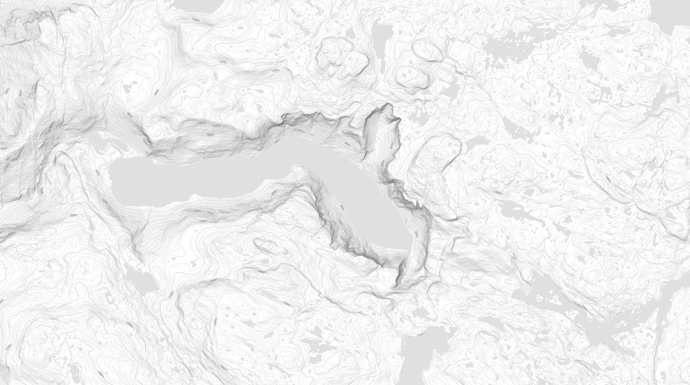

# ContourGenerator

`ContourGenerator` is a fork of [`skylarmt/openmaptiles-contourlines`](https://github.com/skylarmt/openmaptiles-contourlines/) for generating vector elevation contour lines.

The CLI tool is built on top of the OpenMapTiles toolchain and focuses on making the heavy steps faster, while still safe, for large areas through:

- contour multi-threading with `phyghtmap --jobs` (default: `16`)
- persistent elevation-data caching
- streaming MBTiles writing to avoid RAM bottlenecks
- parallel multi-worker shard export with a safe final merge (default: `16`)

### Requirements

To generate contour tiles from `VIEW1`,`VIEW3` DEM you need:

- Docker
- Docker Compose
- Python 3

To generate contour tiles including `SRTM3` DEM you need:

- USGS account to download Srtm3 DEM data

Register for free at [ers.cr.usgs.gov/register](https://ers.cr.usgs.gov/register/).

### Required Runtime Files

- A valid `data/bbox.poly` file:

```text
example
1
   1.758746E+01    5.728675E+01
   1.758753E+01    5.727979E+01
   1.758804E+01    5.727283E+01
   1.758901E+01    5.726588E+01
   1.759042E+01    5.725896E+01
   ...
   1.758746E+01    5.728708E+01
   1.758746E+01    5.728675E+01
END
END
```

### Optional Runtime Files

- A valid `.earthexplorerCredentials` file:

```dotenv
EARTHEXPLORER_USER=your_user_name
EARTHEXPLORER_PASSWORD=your_password
```

### Clone

```bash
git clone https://github.com/grainsngrubble/contour-generator.git
cd contour-generator
chmod +x generator.py
```

### Run

Run the CLI tileset build tool from the command line:

```bash
./generator.py run \
  --prefetch-contours \
  --min-zoom 10 \
  --max-zoom 14 \
  --workers 16 \
  --replicas 16
```

### Result

The final output is written as `.mbtiles` to:

```text
data/tiles.mbtiles
```

### Help

```bash
./generator.py --help
```

### Preview

Example preview of mountainous area with `20 m`, `50 m`, and `100 m` elevation contour lines and labels.



### Performance

- Creating a .MBTiles with zoom level 10-14 of Gotland Island run for about 3 min on a 12 core WSL @ 5.4 GHz
- Creating a .MBTiles with zoom level 10-14 of Europe with margin run for about 14 h on a 12 core WSL @ 5.4 GHz
